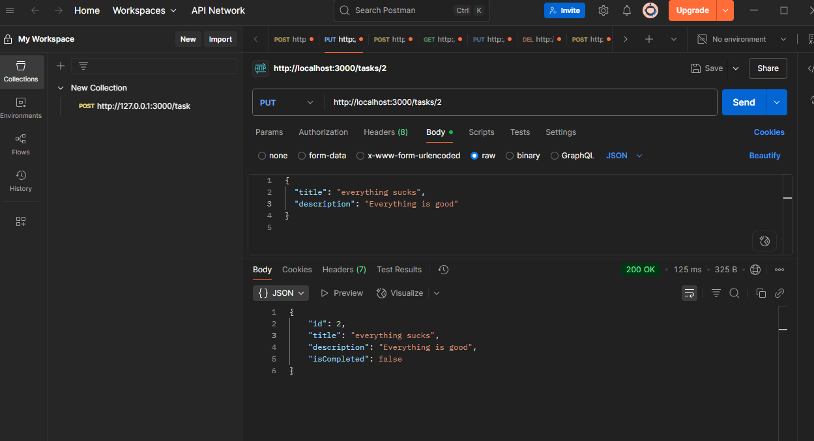

# Task API with Express

This is a simple RESTful API for managing tasks, built using **TypeScript**, **Express.js**, and **Prisma ORM**. It allows users to create, retrieve, update, and delete tasks.

## Features

- Create new tasks

- Retrieve all tasks or a single task by ID

Get all


Get Task by ID

- Update task details

- Delete tasks


## Tech Stack

- **Backend:** Express.js, TypeScript
- **Database:** PostgreSQL
- **ORM:** Prisma
- **Dev Tools:** Nodemon, ts-node-dev

## Installation

1. **Clone the repository:**
   ```bash
   git clone https://github.com/jonny3937/tasks-API-with-express.git
   cd tasks-API-with-express
```